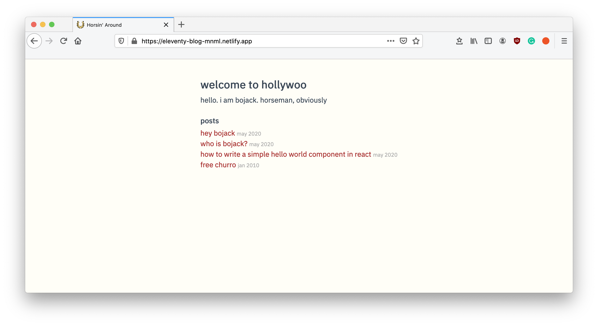

# **eleventy-blog-mnml**

A minimal blog template using [eleventy](https://www.11ty.io/docs/).

## Features

- Write blog posts in markdown 🥳
- Write styles in SCSS 💅🏻

## How to Use?

1. Clone this repo
2. Install dependencies by running `npm i`
3. Add your blog posts (in markdown) in the `posts` folder.
4. Run a copy of the project locally using `npm run serve` to see your changes locally.
5. Run `npm run build` which will build your website in the `_site` folder which you can deploy.

## Screenshot

## Real World Use Case

My personal website, which is available over [here](https://arpitbatra.netlify.app), is built using this template as the base.

## Bugs, Feature Requests or Questions?
Ask away [@arpitbatra123](https://twitter.com/arpitbatra123) on twitter or shoot me a mail at arpitbatra123@gmail.com

## If this project helped you,

